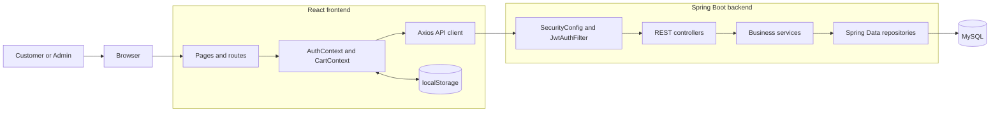
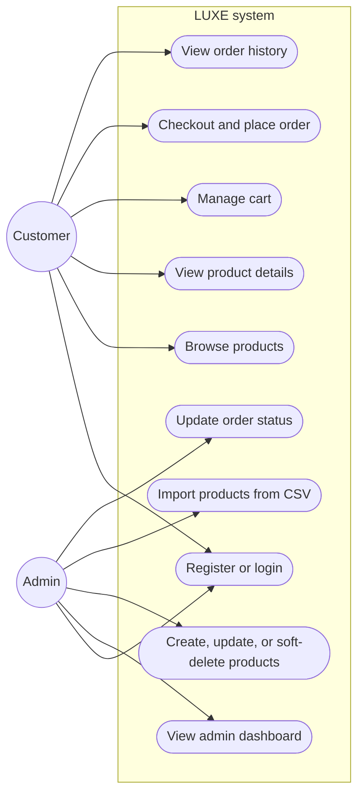
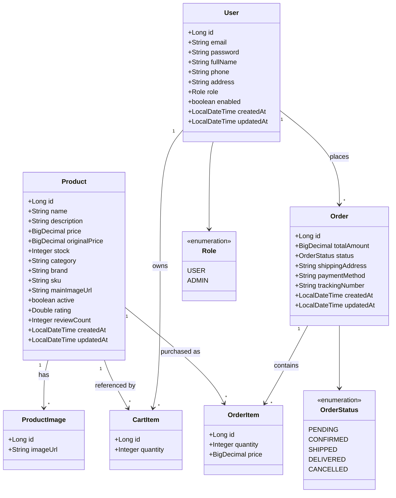
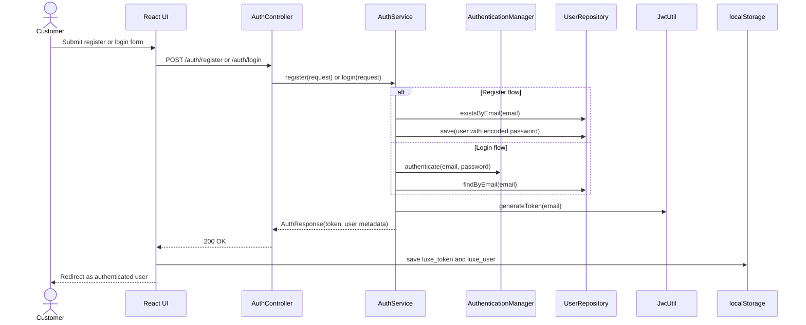
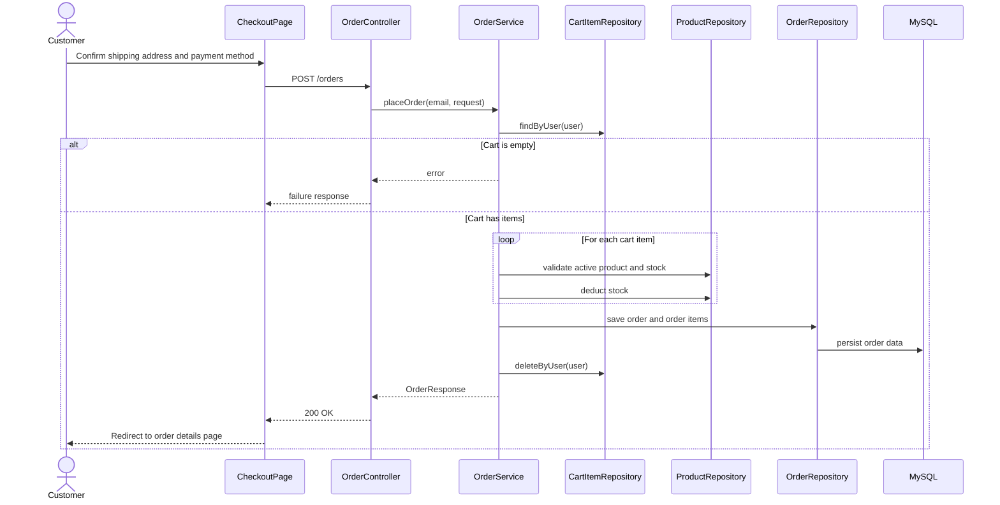
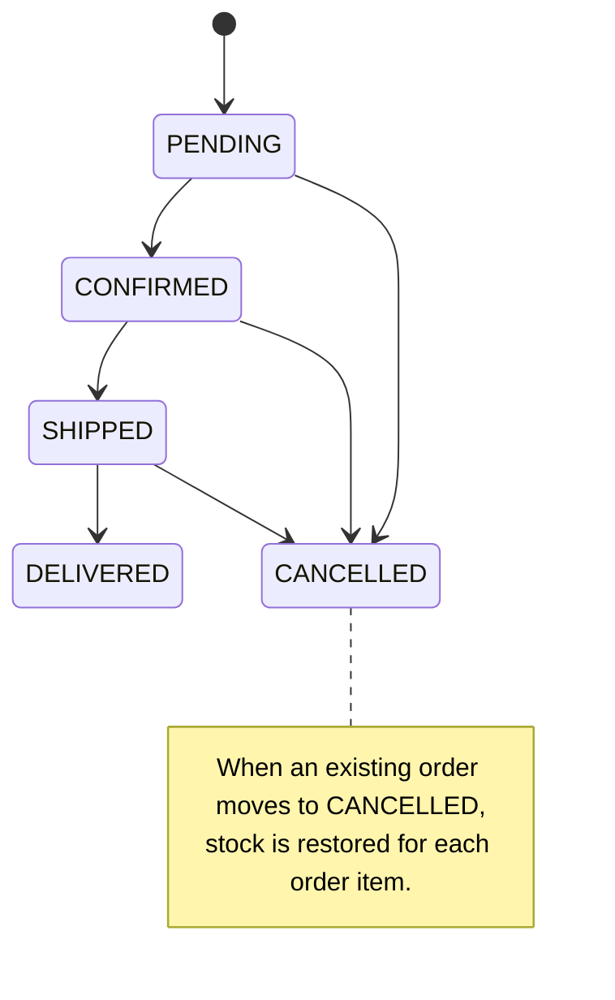
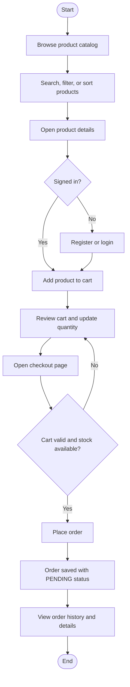
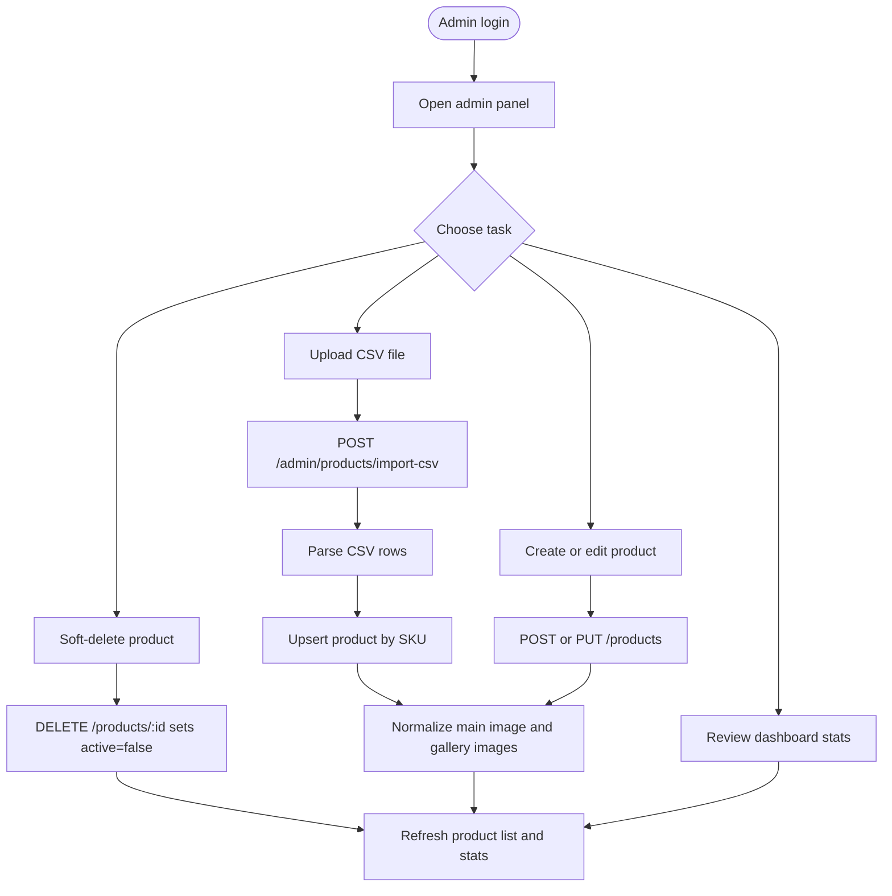
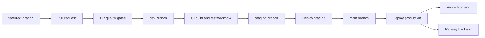
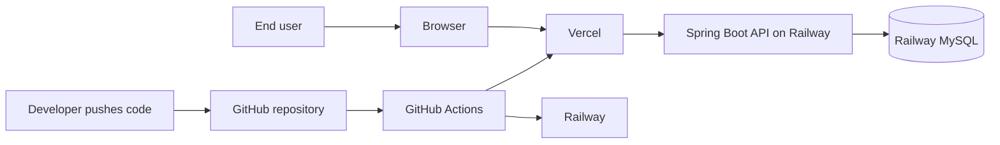

# LUXE Full-Stack E-Commerce Platform

LUXE is a monorepo for a full-stack e-commerce application built with Spring Boot, React, and MySQL. The codebase supports customer shopping flows, JWT-based authentication, order management, and admin catalog operations including CSV-based product import.

## Tech Stack

- Frontend: React 18, Vite, React Router, Axios, React Hot Toast, React Icons
- Backend: Spring Boot 3.2, Spring Web, Spring Data JPA, Spring Security, JWT, Validation, Lombok, Apache Commons CSV
- Database: MySQL 8
- DevOps: Docker Compose, GitHub Actions, Railway, Vercel

## Repository Structure

```text
luxe-fullstack/
|-- .github/
|   `-- workflows/
|       |-- ci.yml
|       |-- deploy-production.yml
|       |-- deploy-staging.yml
|       `-- pr-checks.yml
|-- backend/
|   |-- src/main/java/com/luxe/ecommerce/
|   |   |-- config/
|   |   |-- controller/
|   |   |-- dto/
|   |   |-- model/
|   |   |-- repository/
|   |   |-- security/
|   |   `-- service/
|   |-- src/main/resources/application.properties
|   |-- pom.xml
|   `-- Dockerfile
|-- frontend/
|   |-- public/product-import-template.csv
|   |-- src/
|   |   |-- components/
|   |   |-- context/
|   |   |-- pages/
|   |   |-- services/
|   |   |-- styles/
|   |   `-- utils/
|   |-- package.json
|   |-- vite.config.js
|   `-- vercel.json
|-- docker/
|   `-- docker-compose.yml
|-- docs/
|   |-- CONTRIBUTING.md
|   `-- DEPLOYMENT.md
|-- scripts/
|   `-- setup.sh
|-- product-import-template.csv
`-- README.md
```

## Architecture, UML, and Workflow Diagrams

GitHub renders Mermaid blocks directly, so the diagrams below can be viewed in the repository without extra tooling.

### 1. System Component View



### 2. Use Case Diagram



### 3. Domain Model Class Diagram



### 4. Authentication Sequence Diagram



### 5. Checkout and Order Placement Sequence Diagram



### 6. Order State Diagram



### 7. Customer Shopping Workflow



### 8. Admin Catalog Workflow



### 9. CI/CD Workflow



### 10. Deployment View



## Key Business Rules Captured in the Code

- JWT tokens are created on login and registration, then stored in `localStorage` by the frontend.
- Product listing and product details are public; cart, checkout, orders, and admin endpoints require authentication.
- Admin-only routes are guarded with Spring Security role checks.
- Product deletion is a soft delete: `DELETE /products/{id}` sets `active=false`.
- Inactive products are pruned from carts the next time the cart is loaded or updated.
- Placing an order validates stock, deducts inventory, creates order items, and clears the cart.
- Cancelling an existing order restores stock for each order item.
- CSV imports upsert products by `sku` and build image galleries from the `images` column.

## API Overview

| Area | Endpoints |
|---|---|
| Auth | `POST /api/auth/register`, `POST /api/auth/login` |
| Products | `GET /api/products`, `GET /api/products/{id}`, `GET /api/products/categories`, `POST /api/products`, `PUT /api/products/{id}`, `DELETE /api/products/{id}` |
| Cart | `GET /api/cart`, `POST /api/cart`, `PUT /api/cart/{itemId}?quantity={n}`, `DELETE /api/cart` |
| Orders | `POST /api/orders`, `GET /api/orders`, `GET /api/orders/{id}`, `GET /api/orders/admin/all`, `PATCH /api/orders/{id}/status` |
| Admin | `GET /api/admin/stats`, `POST /api/admin/products/import-csv` |

## Local Development

### Prerequisites

- Java 17
- Maven 3.8+
- Node.js 18+
- npm
- Docker Desktop or Docker Engine

### Option 1: Setup Script

The repository includes `scripts/setup.sh` for bash-based environments such as Linux, macOS, Git Bash, or WSL.

```bash
chmod +x scripts/setup.sh
./scripts/setup.sh
```

### Option 2: Manual Setup

```bash
docker compose -f docker/docker-compose.yml up -d mysql
cd backend
mvn spring-boot:run
```

In a second terminal:

```bash
cd frontend
npm ci
npm run dev
```

### Local URLs

- Frontend: `http://localhost:3000`
- Backend API: `http://localhost:8080/api`
- Swagger UI: `http://localhost:8080/api/swagger-ui.html`
- CSV template: `http://localhost:3000/product-import-template.csv`

## Deployment Targets

| Environment | Frontend | Backend API |
|---|---|---|
| Production | `https://luxe.vercel.app` | `https://luxe-api.railway.app/api` |
| Staging | `https://luxe-staging.vercel.app` | `https://luxe-api-staging.railway.app/api` |

## Useful Commands

```bash
# Backend tests
cd backend
mvn test

# Backend package
cd backend
mvn clean package

# Frontend development
cd frontend
npm run dev

# Frontend production build
cd frontend
npm run build
```

## Related Docs

- `docs/DEPLOYMENT.md`
- `docs/CONTRIBUTING.md`
